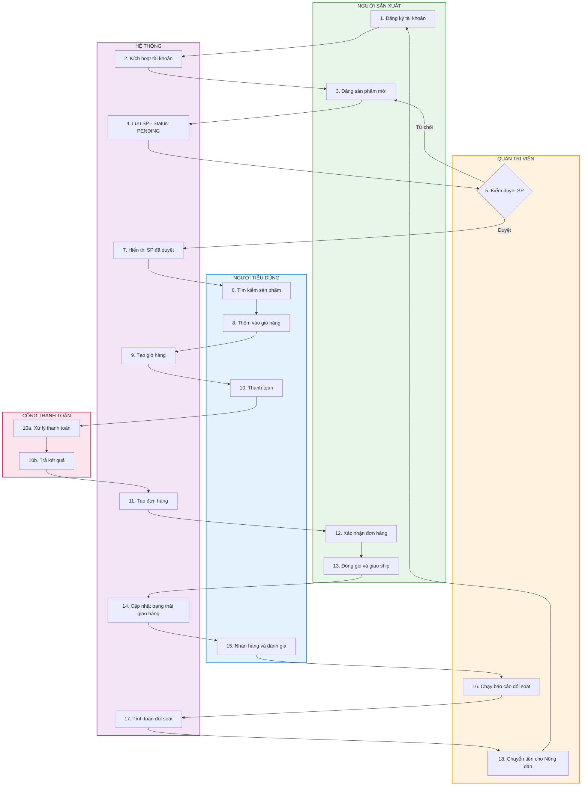
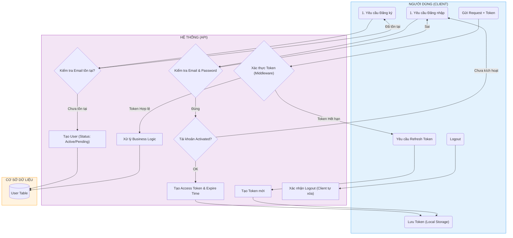
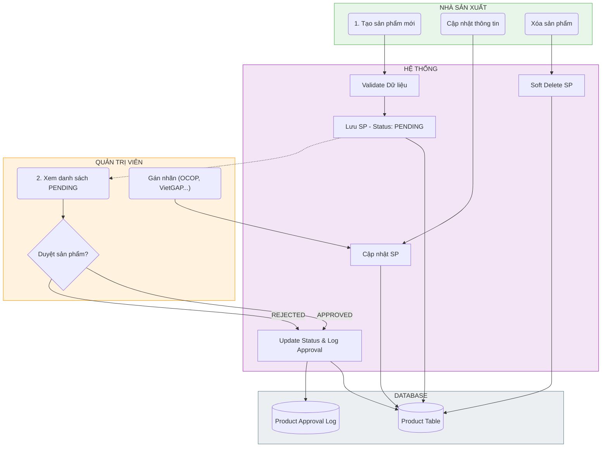
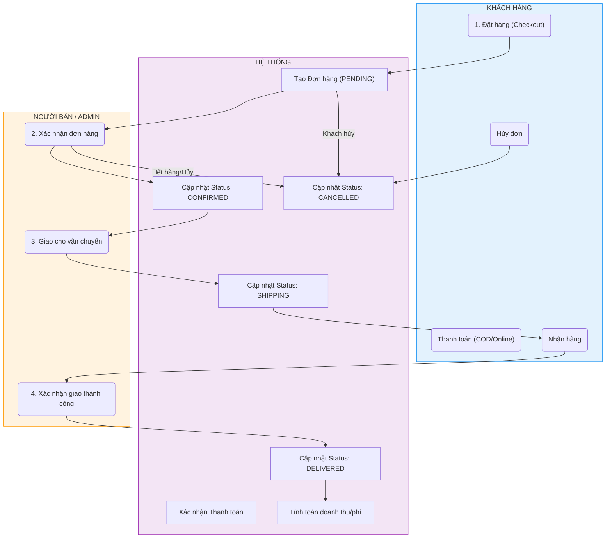
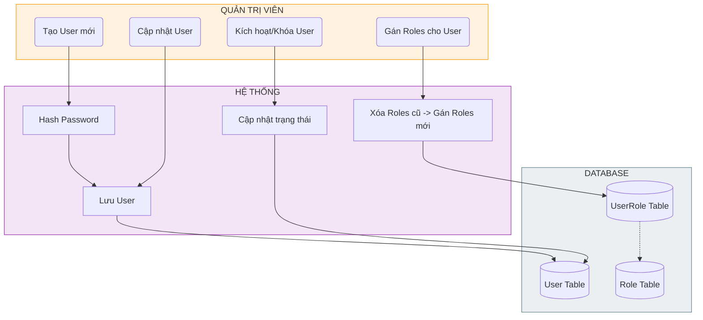
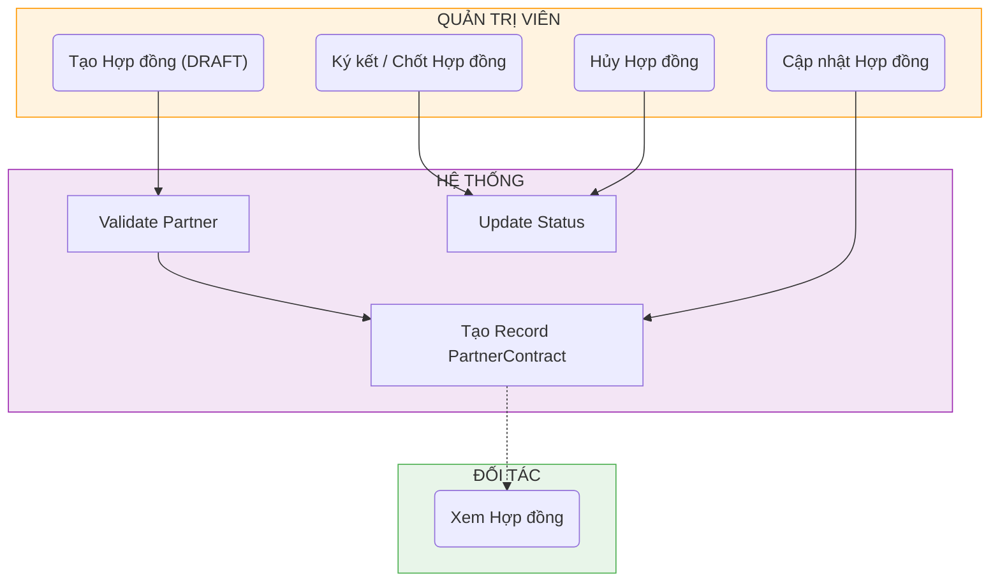
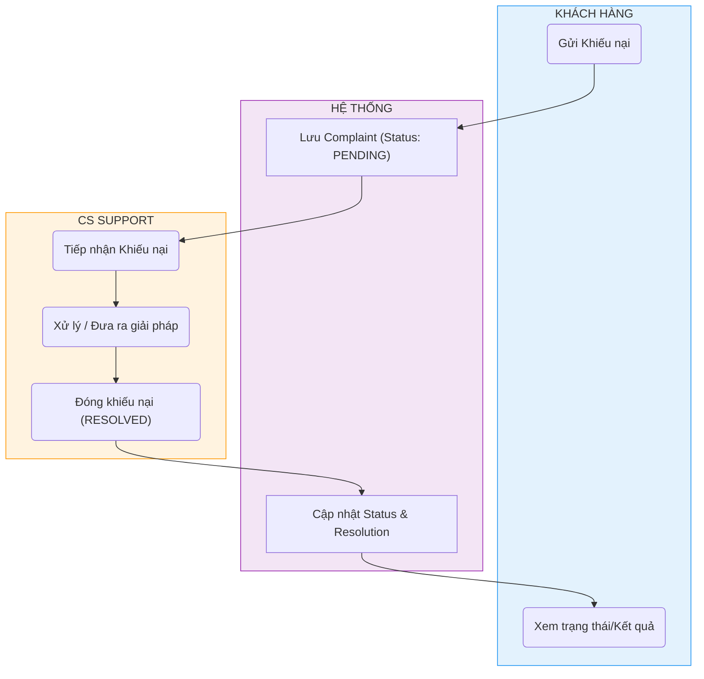
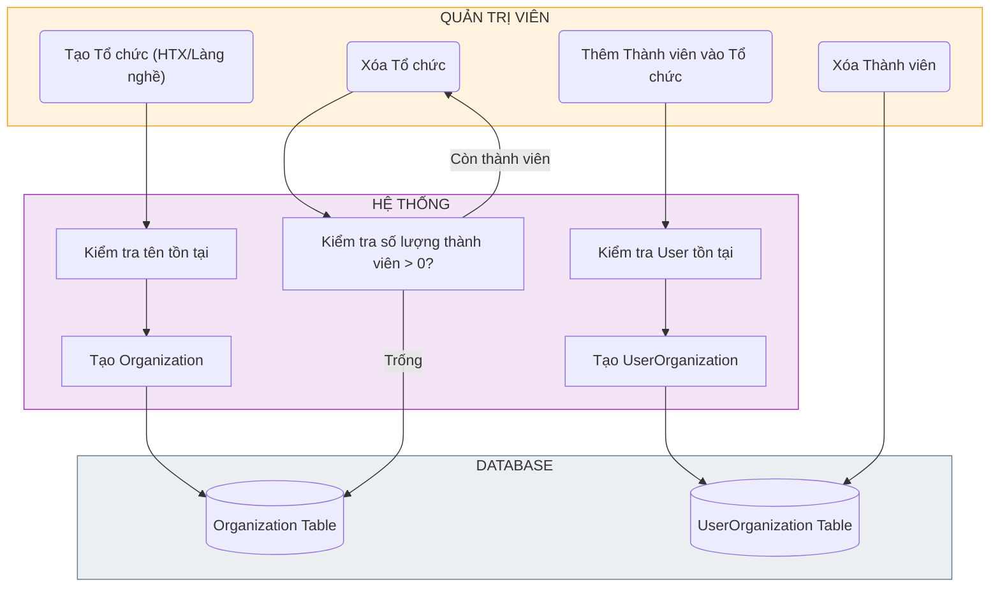

### 1. Quy trình Vận hành Tổng thể - Swimlane Flowchart
Quy trình vận hành từ lúc sản phẩm được tạo ra đến khi đến tay người tiêu dùng và nông dân nhận được thanh toán.

---

### 2. Authentication & Authorization (Auth)
Quy trình xác thực người dùng, đăng ký, đăng nhập và cấp lại token.

### 3. Product Management (Quản lý Sản phẩm)
Quy trình Producer tạo sản phẩm, Admin duyệt và xuất bản.

### 4. Order Processing (Xử lý Đơn hàng)
Quy trình từ lúc đặt hàng đến khi giao hàng thành công.

### 5. User & Access Control (Quản lý User & Phân quyền)
Quản lý người dùng, gán vai trò (Role) và quyền hạn (Permission).

### 6. Contract Management (Quản lý Hợp đồng)
Quản lý hợp đồng hợp tác giữa các bên.

### 7. Complaint Handling (Xử lý Khiếu nại)
Quy trình xử lý phản hồi và khiếu nại từ khách hàng.

### 8. Organization Management (Quản lý Tổ chức)
Quản lý các Hợp tác xã, Làng nghề và thành viên.

